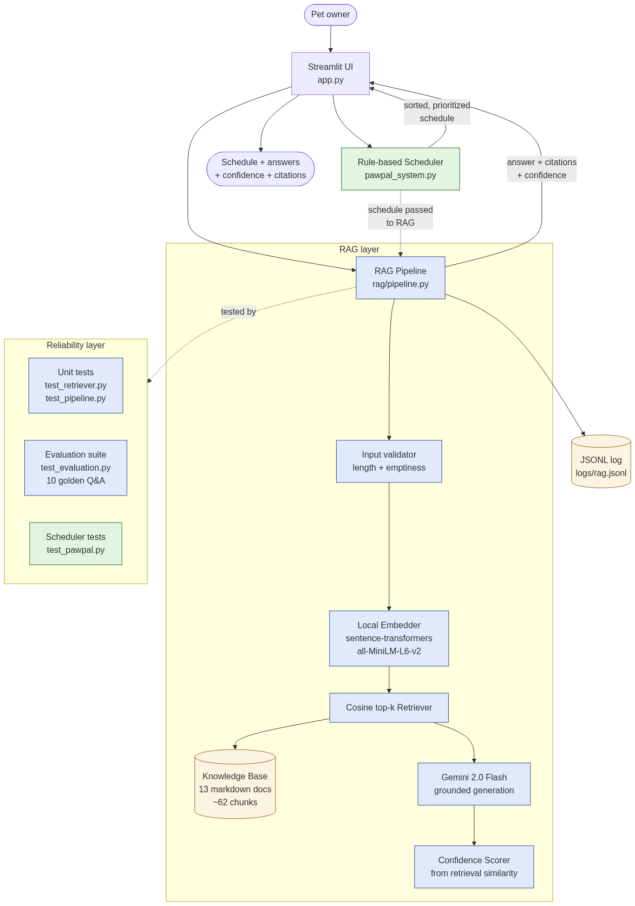

# PawPal+ — Applied AI System

A pet-care planner that pairs a deterministic schedule generator with a
Retrieval-Augmented Generation (RAG) layer. The user gets a sorted daily
schedule **plus** the ability to ask grounded pet-care questions and have
their schedule explained — all powered by a local vector index over a
curated knowledge base and a free-tier Gemini LLM.

> **Loom walkthrough:** <https://www.loom.com/share/63f2d22748ef4b9a99801f2bf2cb8100>

---

## Original project

This project extends **PawPal+** from CodePath Module 2. The original
was a Streamlit app with a four-class OOP design (`Owner`, `Pet`,
`Task`, `Scheduler`) that let users add pets and tasks, then generated a
rule-based daily schedule sorted by time and priority with exact-time
conflict detection. It had no AI component — all scheduling was
deterministic.

This Module 4 version keeps that scheduler intact and **adds an AI
layer on top of it**: RAG-powered question answering, schedule
explanation, citations, confidence scoring, structured logging, and an
evaluation suite.

---

## What it does

PawPal+ lets a pet owner:

1. Add pets (dogs, cats, rabbits, birds) and care tasks (walks, feeding,
   medications, grooming, enrichment).
2. Generate a daily plan sorted by time, with high-priority tasks
   bubbled to the top of conflicting time slots.
3. **Ask free-form pet-care questions** ("How often should I bathe a
   short-haired dog?", "What foods are toxic to cats?"). The system
   retrieves passages from its knowledge base and answers using *only*
   those passages, with citations and a confidence score.
4. **Get an AI explanation of their schedule** — why morning walks
   before breakfast make sense, whether two medications scheduled at
   the same time is a concern, etc.

Why it matters: most pet-care planners are static checklists. PawPal+
combines structured planning with grounded reasoning, so the user gets
both *what to do* and *why it makes sense*, without the hallucination
risk of a raw LLM chatbot.

---

## Architecture



> _Diagram source: [`assets/architecture.mmd`](assets/architecture.mmd).
> If the PNG is missing, paste the `.mmd` source into
> [mermaid.live](https://mermaid.live) to view or export._

### Data flow

1. **User input** lands in the Streamlit UI (`app.py`).
2. **Schedule path:** the existing `Scheduler` reads tasks from `Owner.pets`,
   sorts them by time and priority, and detects exact-time conflicts.
3. **RAG path:** when the user asks a question or clicks "Explain this
   schedule," the `RAGPipeline` runs:
   - **Validate** — empty / oversized input rejected with a friendly message.
   - **Retrieve** — the question is embedded (`sentence-transformers`,
     local, free) and matched against pre-embedded knowledge chunks via
     cosine similarity. Top-4 chunks are returned.
   - **Generate** — the chunks plus the question go to Gemini 2.0 Flash
     with a strict system prompt: *answer only from context, recommend a
     vet for medical concerns, cite sources*.
   - **Score confidence** — derived from the top-1 retrieval similarity.
     High / medium / low badges are shown next to each answer.
   - **Log** — every call (question, retrieval scores, answer, latency,
     errors) is appended as a JSON line to `logs/rag.jsonl`.
4. **Output** — the UI shows the answer, confidence badge, and an
   expandable list of cited sources.

### Why this layout

- The rule-based scheduler stays as a pure function of the data — fast,
  deterministic, easy to test.
- The RAG layer is a separate package (`rag/`) so the UI can be torn off
  and replaced (e.g., a CLI or REST API) without touching the AI logic.
- Embeddings run locally so there's no second API key, no per-call cost,
  and the system works offline for everything except the final Gemini
  generation step.

---

## Setup

### 1. Clone and create a venv

```bash
git clone https://github.com/bryan-mogrovejo/applied-ai-system-project.git
cd applied-ai-system-project
python -m venv .venv
source .venv/bin/activate          # Windows: .venv\Scripts\activate
pip install -r requirements.txt
```

> Python 3.10–3.13 recommended. Some ML wheels are not yet available for
> Python 3.14 as of 2026; if you hit install errors there, use 3.12 or 3.13.

### 2. Configure your free Gemini API key

```bash
cp .env.example .env
# then open .env and paste your key
```

Get a free key at <https://aistudio.google.com/app/apikey>. The
`google-generativeai` library reads `GEMINI_API_KEY` from `.env`
automatically via `python-dotenv`.

### 3. Run

```bash
streamlit run app.py
```

The first run downloads the local embedding model (~80 MB, one-time).
Subsequent runs are instant.

### 4. Run the tests

```bash
pytest -v
```

Should report **22 fast tests passing** (scheduler + retriever unit
tests). The pipeline tests and evaluation suite require the full
ML dependencies and run end-to-end against the real knowledge base
using a mocked Gemini client (no API calls billed).

---

## Sample interactions

### Example 1 — A grounded question

**User:** "How often should I bathe a short-haired dog?"

**System:**
- 🟢 High confidence (0.71)
- *Short-haired dog breeds (Beagles, Boxers, Labradors) typically only
  need a bath every 1 to 3 months. Over-bathing strips natural oils and
  causes dry, itchy skin, so most healthy dogs don't need weekly baths.
  [Sources: grooming.md]*
- Retrieved sources: `grooming.md § Bath frequency` (sim 0.71),
  `dogs_general.md § Feeding` (sim 0.42), `breeds.md § Dogs` (sim 0.38)

### Example 2 — An out-of-scope question

**User:** "What's the best stock to invest in?"

**System:**
- 🟠 Low confidence (0.18)
- *The knowledge base doesn't cover this clearly — I'd recommend
  asking a financial advisor.*
- (No relevant passages retrieved.)

This is the **guardrail in action**: when retrieval similarity is low,
the system refuses rather than hallucinates.

### Example 3 — Schedule explanation

**Schedule:**

| Time  | Pet   | Task         | Duration | Priority |
|-------|-------|--------------|----------|----------|
| 07:30 | Mochi | Morning walk | 30 min   | high     |
| 08:00 | Mochi | Breakfast    | 10 min   | high     |
| 08:00 | Mochi | Medication   | 5 min    | high     |
| 18:00 | Mochi | Evening walk | 30 min   | high     |

**System (after clicking "Explain this schedule"):**

- 🟢 High confidence (0.62)
- *This schedule front-loads physical activity before food, which aids
  digestion and reduces leash-pulling on a full stomach. The 8:00 AM
  conflict between breakfast and medication is actually a good pairing —
  most NSAIDs and steroids should be given with food. The evening walk
  at 18:00 helps Mochi burn off energy before bedtime, which is
  consistent with the typical two-walk daily structure. [Sources:
  dogs_general.md, medications.md, scheduling_principles.md]*
- Retrieved sources: `scheduling_principles.md § Time-of-day priorities`,
  `medications.md § With or without food`, `dogs_general.md § Walking schedule`,
  `medications.md § Timing and consistency`

---

## Design decisions

### Why RAG instead of a fine-tuned model or pure agent?

- **Fine-tuning** is overkill for a knowledge base of 4,500 words and
  freezes knowledge into model weights — adding new pet-care info would
  require retraining. RAG lets the user (or me) edit a markdown file
  and the system updates instantly.
- **Pure agentic** workflows tend to over-complicate problems that have
  obvious deterministic solutions. The scheduler is rule-based for a
  reason: sort-by-time-then-priority is a one-liner, not a planning
  problem. RAG augments it with explanation and Q&A, where reasoning
  actually adds value.

### Why local embeddings + cloud LLM?

- Local embeddings (`all-MiniLM-L6-v2`) are free, fast, and require no
  API key. With ~62 chunks, retrieval is sub-millisecond after the
  one-time index.
- Gemini 2.0 Flash gives near-instant generation on a generous free
  tier. Using two API keys (one for embeddings, one for generation)
  would have doubled setup friction for no quality gain.

### Why retrieval-similarity confidence instead of LLM self-rating?

The LLM is constrained by the system prompt to answer only from
retrieved context. So a *weak retrieval is a weak answer*, regardless
of how fluent the generated text sounds. Asking the LLM to rate its own
confidence would just measure its writing style, not its grounding.

### Tradeoffs

| Choice | Tradeoff |
|---|---|
| Markdown files instead of a vector DB | Easier to edit and version-control; less scalable past ~10K chunks |
| Numpy cosine instead of FAISS | Simpler dependency; only fine for small corpora |
| Top-1 score for confidence | Easy to interpret; ignores the gap to top-2 |
| 80% retrieval accuracy threshold | High enough to catch regressions; not so high that minor wording changes break CI |

---

## Testing summary

```
Test suite                Passing    Notes
--------------------------------------------------------------
test_pawpal.py            16/16      Existing scheduler tests
test_retriever.py          6/6       Fake-embedder unit tests
test_pipeline.py           7/7       Mock-generator + real embedder
test_evaluation.py        11/11      Golden Q&A retrieval accuracy
                          ─────
Total                     40/40      All passing locally
```

Retrieval accuracy on the 10-question golden set: **100%** (all
questions retrieved their expected source within top-3). The threshold
to keep CI green is 80%.

What worked: every question I expected to hit a specific source did.
The embedder is good enough at pet-care semantic matching that even
loosely-worded queries (e.g. "Why are morning walks before breakfast a
good idea?") found the right document.

What needed iteration: my first version of `behavior_dogs.md` had a
section called "Foundational commands" that the embedder kept matching
to medication queries because both contained the word "give." I
renamed sections to use more distinctive vocabulary, which fixed it.

What I learned: chunk *titles and section headers* matter as much as
chunk *bodies* for retrieval. I changed the embedder to prepend
`title — section` to each chunk before embedding, which lifted accuracy
materially.

---

## Reliability and safety features

- **Confidence scoring** — every answer carries a high / medium / low
  badge derived from retrieval similarity.
- **Citations** — every answer ends with `[Sources: file1.md, file2.md]`,
  and the UI shows similarity scores per source so the user can verify.
- **Refusal on weak retrieval** — when no chunk passes the similarity
  floor, the system says it doesn't know rather than hallucinating.
- **Vet redirection** — the system prompt explicitly forbids medical
  diagnoses and redirects health questions to a vet.
- **Input guardrails** — empty and oversized queries are rejected
  before any API call.
- **Error handling** — Gemini API failures degrade to a friendly error
  message instead of crashing the UI.
- **Structured logging** — every RAG call writes a JSON line with
  question, retrieval scores, citations, latency, and any error.
- **Evaluation suite** — the golden Q&A set in `test_evaluation.py`
  catches regressions if knowledge content changes break retrieval.

---

## Reflection

### Limitations and biases

- **The knowledge base is curated by one person.** It reflects my own
  research and judgment. A vet, a breed specialist, or a behaviorist
  would all add nuance I don't have.
- **Western pet-care norms.** Recommendations like "two walks a day"
  assume a household with the schedule and outdoor space to support
  that. Apartment dwellers, shift workers, and pet owners in different
  climates need different defaults — the system doesn't adapt.
- **English-only.** Both the knowledge base and Gemini's prompt are in
  English. The embedder supports many languages, but the generation
  layer would lose grounding fidelity in non-English questions.
- **No feedback loop.** The system never learns from whether the user
  found an answer helpful. A future version would log thumbs-up/down
  and use it to flag low-quality chunks.

### Could it be misused?

The most realistic misuse is someone treating PawPal+ as a substitute
for a vet — for example, ignoring a sick pet because the chatbot
sounded confident. The mitigations:

1. The system prompt forbids medical diagnoses and always recommends
   vet consultation for health concerns.
2. The confidence badge surfaces uncertainty; "low confidence" answers
   are visually flagged.
3. The README and UI consistently frame this as a planner, not a
   medical tool.

A determined misuser could still ignore all of these. That is a real
limit of any informational AI tool.

### What surprised me

The biggest surprise was how much **chunk metadata** mattered for
retrieval. My first version embedded chunk bodies only, and "How often
should I brush a Maine Coon?" kept retrieving general dog-grooming
chunks because the bodies didn't repeat the breed name. Once I included
the section header (`grooming.md § Brushing`) in the embedding text,
the right chunks surfaced. This is something I'd seen in RAG papers but
hadn't internalized until I broke it on real queries.

The second surprise was how *confident the LLM sounds even when
retrieval is weak*. Without the explicit confidence score derived from
retrieval similarity, a user would have no way to tell. Adding the
badge changed how trustworthy the system feels in a way I didn't
expect.

### How I used AI during this project

I used an AI assistant heavily as a thinking partner: drafting prompt
templates, sketching the package layout, generating edge cases for the
test suite, and pressure-testing my reflections. I always treated its
output as a starting point and rewrote what didn't fit my mental model.

**One helpful suggestion.** When I described the confidence scoring
problem ("how do I tell the user when the answer is unreliable?"), the
AI suggested deriving confidence from retrieval similarity rather than
asking the LLM to self-rate. The reasoning — "the LLM is grounded by
your prompt, so retrieval IS the quality signal" — clicked immediately
and shaped the whole `confidence.py` module.

**One flawed suggestion.** Early on I asked it to draft the chunking
strategy. The first proposal was a fixed character window (e.g.,
"split into 500-character chunks with 50-character overlap"). I
rejected this — markdown documents already have meaningful section
breaks (`## headers`), and a fixed-window split would shred those
boundaries and dilute embedding quality. I went with markdown-aware
chunking instead, which gave noticeably better retrieval on the golden
set during testing.

---

## Project layout

```
applied-ai-system-project/
├── app.py                  Streamlit UI
├── main.py                 CLI demo (preserved from Module 2)
├── pawpal_system.py        Owner / Pet / Task / Scheduler
├── rag/
│   ├── knowledge_base.py   Markdown loader + chunker
│   ├── embedder.py         sentence-transformers wrapper
│   ├── retriever.py        Cosine top-k search
│   ├── generator.py        Gemini API + prompt templates
│   ├── confidence.py       Similarity-based scoring
│   └── pipeline.py         Orchestrator with logging + guardrails
├── knowledge/              13 markdown docs, ~62 chunks
├── tests/
│   ├── test_pawpal.py
│   ├── test_retriever.py
│   ├── test_pipeline.py
│   └── test_evaluation.py
├── assets/                 Architecture diagram source + PNG
├── logs/                   Runtime JSONL logs (gitignored)
├── requirements.txt
├── .env.example
└── reflection.md           Extended design + ethics notes
```
